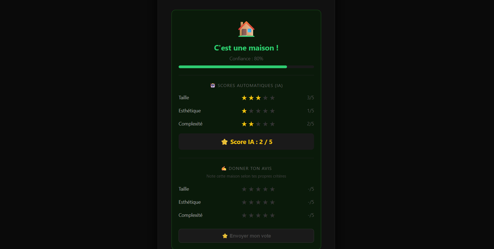
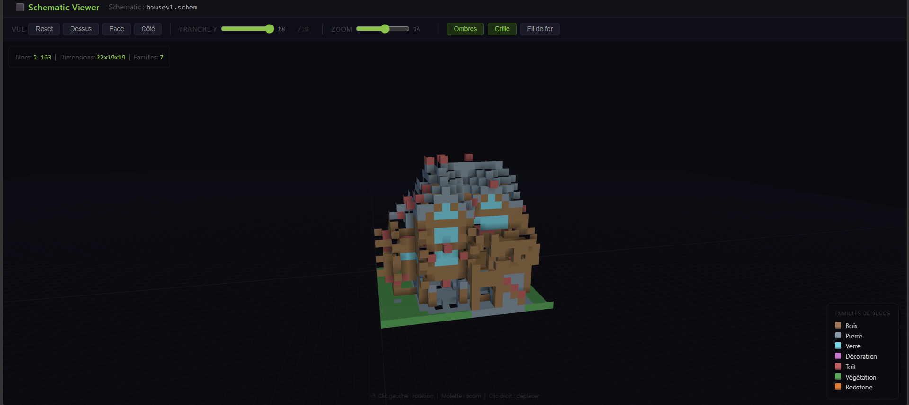

# Minecraft Schematic AI Classifier

<p align="center">
  
  
  
  
</p>

> Système d'intelligence artificielle capable d'analyser automatiquement des structures Minecraft exportées au format `.schem` ou `.schematic` pour les classifier et évaluer leur qualité architecturale.

## 🚀 À propos du projet## 📸 Aperçu visuel

<p align="center">
  
  <br>
  <em>Figure 1 : Interface principale avec résultat de classification et scoring IA.</em>
</p>

<p align="center">
  
  <br>
  <em>Figure 2 : Visualiseur 3D interactif des structures analysées.</em>
</p>


Ce projet implémente un pipeline complet de Machine Learning appliqué au gaming. Il transforme des données binaires NBT (Minecraft) en tenseurs numériques, permet la classification binaire (Maison vs Non-Maison) et génère des scores esthétiques basés sur la densité des matériaux.

## 🛠️ Méthodologie et Défis Techniques

### 1. Organisation et Structuration

Nous avons adopté une architecture **modulaire** pour séparer clairement les responsabilités :

- **Ingestion des données :** Le dossier `data/` contient notre dataset labellisé. Nous avons normalisé chaque fichier pour qu'il soit lisible par notre parser.
- **Pipeline de traitement :** Le dossier `parsing/` transforme le binaire NBT en structures manipulables. Chaque fichier a un rôle précis (lecture, nettoyage, extraction).
- **Isolation logicielle :** Grâce à `Docker`, nous avons encapsulé l'intégralité de l'environnement (Python, bibliothèques, API) pour garantir que le projet fonctionne à l'identique sur n'importe quelle machine.

### 2. Problèmes rencontrés et Solutions

- **La gestion du vide (Sparsity) :** Dans Minecraft, une structure est composée à 90% d'air.
  - *Solution :* Nous avons implémenté un algorithme de "Crop" dynamique qui détecte les limites réelles de la construction pour ignorer le vide inutile et se concentrer sur les blocs solides.

- **Le Scoring déceptif :** Au début, nos builds avaient tous un score très bas à cause de la faible densité de blocs par rapport au volume total.
  - *Solution :* Nous avons développé un algorithme de **normalisation par amplification** (x15). Ce facteur multiplicateur permet de rehausser la note pour qu'elle soit proportionnelle à la complexité esthétique perçue par un joueur humain.

- **La communication Client-Serveur :** Le navigateur bloquait les requêtes vers l'API à cause des règles de sécurité (CORS).
  - *Solution :* Nous avons configuré un *middleware* dans FastAPI pour autoriser les requêtes provenant de notre frontend, assurant une connexion fluide et sécurisée.

### 3. Workflow de développement

1. **Exploration :** Analyse des fichiers `.schem` dans des notebooks Jupyter pour comprendre la structure NBT.
2. **Développement du modèle :** Entraînement du *Random Forest* sur les caractéristiques extraites.
3. **Conteneurisation :** Rédaction du `Dockerfile` pour automatiser l'installation des dépendances.
4. **Interface :** Création du viewer 3D pour rendre les résultats du modèle transparents et compréhensibles.

## ⚙️ Prérequis techniques

- **Docker & Docker Compose** (installés et démarrés)
- Un navigateur web moderne

## 🛠️ Installation et Démarrage

```bash
# 1. Cloner le dépôt
git clone https://github.com/Denzo92i/projet-minecraft-ia.git
cd projet-minecraft-ia

# 2. Lancer l'environnement
docker-compose up --build
```

Accéder à l'application :

| Service | URL |
|---|---|
| API | http://localhost:8000 |
| Documentation interactive | http://localhost:8000/docs |
| Statut du serveur | http://localhost:8000/health |
| Frontend | `frontend/index.html` (ouvrir dans le navigateur) |
| Viewer 3D | `frontend/viewer.html` (ouvrir dans le navigateur) |

## 🧠 Pipeline de données & IA

Le projet suit une logique de traitement séquentiel pour garantir la précision :

1. **Parsing NBT** : Lecture du format Sponge/Minecraft via `nbtlib`.
2. **Prétraitement** : Nettoyage des voxels d'air et normalisation de la grille 3D en `32×32×32`.
3. **Extraction de features** : Calcul de 15 caractéristiques (densité, volume englobant, ratio de matériaux...).
4. **Classification** : Modèle *Random Forest* (`scikit-learn`) pour la prédiction binaire Maison / Non-Maison.
5. **Scoring** : Algorithme de normalisation par amplification de densité (×15) pour générer un score de 1 à 5.

## 📂 Structure du dépôt
projet-minecraft-ia/

├── api/                # Backend FastAPI (routes, logique métier)

│   └── main.py

├── data/               # Dataset labellisé

│   ├── maison/         # Fichiers .schem classifiés "maison"

│   └── autre/          # Fichiers .schem classifiés "autre"

├── frontend/           # Interface Web (HTML/JS)

│   ├── index.html      # Classificateur principal

│   └── viewer.html     # Viewer 3D des structures

├── model/              # Modèle entraîné

│   └── classifier.pkl

├── parsing/            # Pipeline de lecture et décodage NBT

│   ├── parser.py

│   ├── preprocessor.py

│   └── features.py

├── Dockerfile

├── docker-compose.yml

├── requirements.txt

└── README.md


## 👥 Équipe

Projet développé par **Dylan**, **Lola** et **Nicolas** dans le cadre du cursus NationsGlory.
